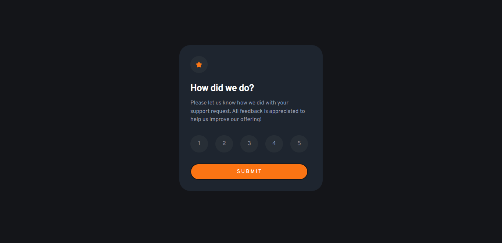

# Frontend Mentor - Interactive rating component solution

This is a solution to the [Interactive rating component challenge on Frontend Mentor](https://www.frontendmentor.io/challenges/interactive-rating-component-koxpeBUmI). Frontend Mentor challenges help you improve your coding skills by building realistic projects. 

## Table of contents

- [Overview](#overview)
  - [The challenge](#the-challenge)
  - [Screenshot](#screenshot)
  - [Links](#links)
- [My process](#my-process)
  - [Built with](#built-with)
  - [What I learned](#what-i-learned)
  - [Continued development](#continued-development)
- [Author](#author)

## Overview

### The challenge

Users should be able to:

- View the optimal layout for the app depending on their device's screen size
- See hover states for all interactive elements on the page
- Select and submit a number rating
- See the "Thank you" card state after submitting a rating

### Screenshot



### Links

- Solution URL: [Add solution URL here](https://www.frontendmentor.io/solutions/expenses-chart-component-Uqg3fkBgzi)
- Live Site URL: [Add live site URL here](https://khalteck.github.io/interactive-rating)

## My process

### Built with

- Semantic HTML5 markup
- CSS custom properties
- Flexbox
- Mobile-first workflow
- [Tailwindcss](https://tailwindcss.com/) - CSS framework

### What I learned

Extremely proud of myself for this piece of js code!

```js
btn.addEventListener("click", function() {
    if (clicked1 === true || clicked2 === true || clicked3 === true || clicked4 === true || clicked5 === true) {
        rateUs.classList.add("hide-div");
        thank.classList.remove("hide-div");
    } else if (clicked1 === false || clicked2 === false || clicked3 === false || clicked4 === false || clicked5 === false){
        alert("You have not given us a rating!");
    }
});
```

### Continued development

Could really work on my javascript code, its kind of repetitive and long.

## Author

- Website - [Khalid Oyeneye](https://khalteck.github.io/New-portfolio/)
- Frontend Mentor - [@khalteck](https://www.frontendmentor.io/profile/khalteck)
- Twitter - [@khalteck](https://www.twitter.com/khalteck)
